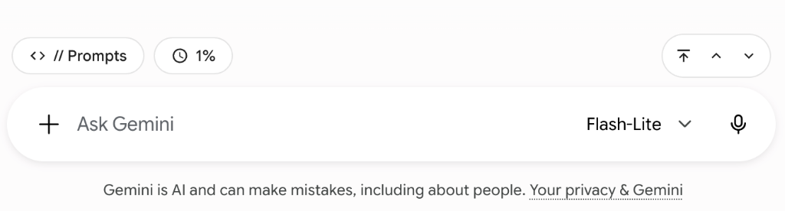
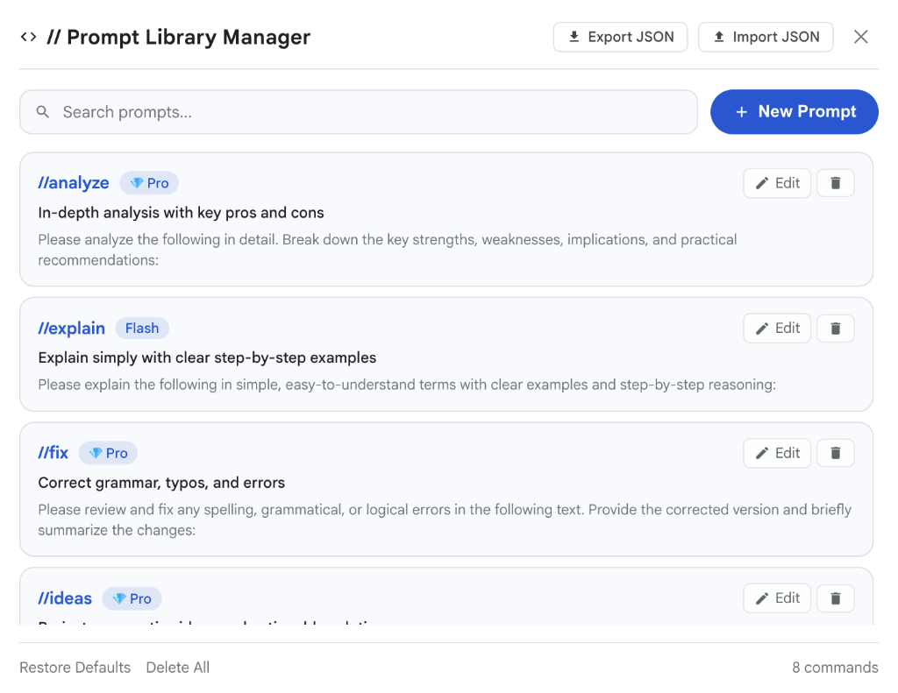
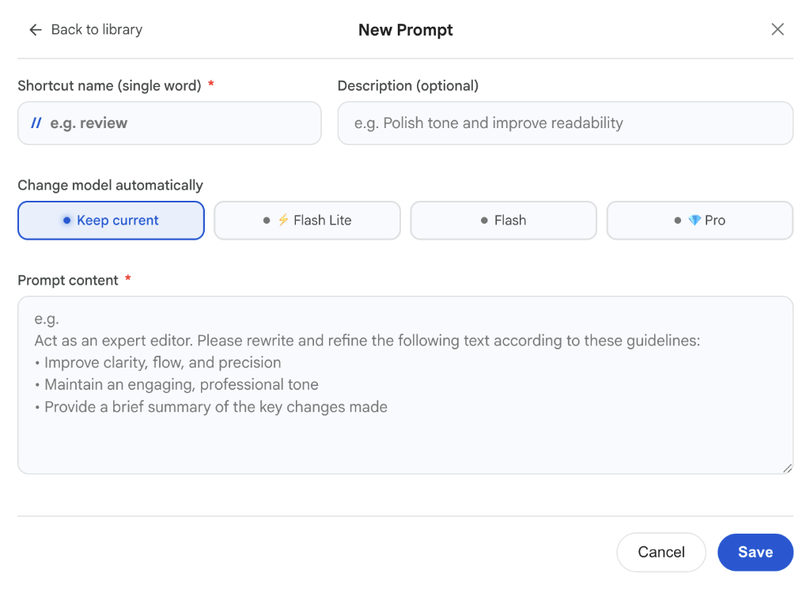

# ⚡ gemini-superpower-chrome-extension

A Google Chrome extension designed specifically for the **Google Gemini** web app (`gemini.google.com`), adding superpowers seamlessly integrated with Google's native Material You design system.

  
    
  
    
  

---

## 🚀 Features

1. **Floating Superpowers Toolbar (Gemini Native Look & Feel)**:
   - Injected directly above the chat prompt input card, perfectly matched to its width.
   - **`// Prompts` button**: Instant one-click access to the Quick Prompts menu and in-page Prompt Editor.
   - Seamless design supporting both Light and Dark themes automatically.

2. **Official Usage Limits & Reset Timers (5-Hour & Weekly)**:
   - Interactive usage badge (`🕒 X%`) showing your current Gemini quota directly on the toolbar.
   - **100% Language-Agnostic Engine**: Accurately tracks quota percentages and reset schedules across all 45+ languages supported by Google Gemini without relying on localized keyword or month dictionaries.
   - **Background Synchronization**: Automatically synchronizes Gemini's official usage limits in the background via Declarative Net Request rules, keeping your metrics up to date during normal chat without needing to open the native settings modal.
   - On-demand floating popover card with live countdown timers:
     - **5-hour usage**: Current usage percentage and exact reset time with live countdown (e.g. *1% used • Resets at 4:47 PM (in 2h 45m)*).
     - **Weekly limit**: Weekly usage percentage and exact reset date/time with countdown (e.g. *2% used • Resets Sep 17 at 5:47 PM*).
     - **Live status**: `🟢 Synced with your latest prompt` (updates seamlessly as you chat).
   - **Smart Popover Auto-Dismiss**: Closes cleanly whenever focus shifts away, the window blurs, the user clicks outside, or the `Escape` key is pressed.

3. **User Prompt Navigator (`⤒`, `^` and `v`)**:
   - Jump smoothly and instantly between your previous and next user query prompts without tedious manual scrolling, skipping long model responses.
   - **Direct Scroll to Top (`⤒`)**: Dynamic button that reveals itself whenever you scroll down to take you straight to the beginning of the conversation in one click.
   - **Smart Disabled States**: Navigation buttons automatically disable when reaching the top, bottom, or in an empty conversation.

4. **Single-Word Quick Prompts (`//`) & Prompt Library Manager**:
   - Type `//` inside the chat box or click `// Prompts` to open the autocomplete menu (`//summary`, `//explain`, `//improve`, `//fix`, `//ideas`, `//analyze`, `//reply`, `//translate`).
   - Type `//improve` + `Space`, `Tab`, or `Enter` to instantly prepend the prompt template at the beginning of your text with the cursor positioned at the end.
   - **Prompt Library Manager**: Click `📚 Library` in the popover header to manage your prompts right within Gemini:
     - **Library View**: Instant search & filter, rich prompt preview cards, model badges, and quick actions to edit, delete, or restore defaults.
     - **Editor View**: Focused creation & editing screen with duplicate shortcut validation, required field indicators, and interactive model switcher chips (*`Keep current`*, *`⚡ Flash Lite`*, *`Flash`*, *`💎 Pro`*).
   - **Auto-Model Switcher**: Automatically switch Gemini to your preferred model (*`⚡ Flash Lite`*, *`Flash`*, or *`💎 Pro`*) whenever a prompt is inserted.
   - **Secure JSON Import & Export**: Easily backup or share your prompt library as a JSON file. Includes strict input sanitization against XSS/injections, pre-import confirmation, and a granular summary reporting newly added, updated, and identical prompts.

5. **Smart Auto-Focus**:
   - The chat prompt input automatically gets focused whenever you open the page or switch back to the Gemini tab/window.
   - Global shortcuts: Press `/` or `Cmd+K` (Mac) / `Ctrl+K` at any time to instantly focus the input without touching your mouse.

6. **Wide Mode (Full Width) Toggle**:
   - Toggle button in the top-right header (placed directly next to the overflow menu) to switch between standard view and full-width layout.
   - Expands the chat history, conversation turns, model response markdown, input card, and toolbar across the screen without affecting the left sidebar.
   - Remembers your wide mode preference in local storage.

7. **Bulk Delete Recent Conversations**:
   - Clean "Delete all" action integrated into the recent conversations sidebar header using the native Material delete icon.
   - Native confirmation dialog with silent, background batch deletion.

8. **Internationalization & Multi-Language Support (i18n)**:
   - Full native localization for English, Spanish, German, French, Italian, Portuguese, Japanese, and Russian.
   - Automatically adapts all toolbar controls, prompt menus, library managers, usage cards, and dialogs to match your browser's language setting.

---

## 🛠️ Installation in Google Chrome (Mac)

1. Open Google Chrome and navigate to `chrome://extensions/`.
2. Enable **Developer mode** (toggle in the top right corner).
3. Click **Load unpacked**.
4. Select the cloned `gemini-superpower-chrome-extension` project folder.
5. Open or refresh [https://gemini.google.com/](https://gemini.google.com/) to start using your new superpowers!

---

## 🤝 Contributing

Contributions, issues, and feature requests are welcome! Please check out the [Contributing Guidelines](CONTRIBUTING.md) before submitting a pull request.

---

## 📄 License

This project is licensed under the [MIT License](LICENSE).
